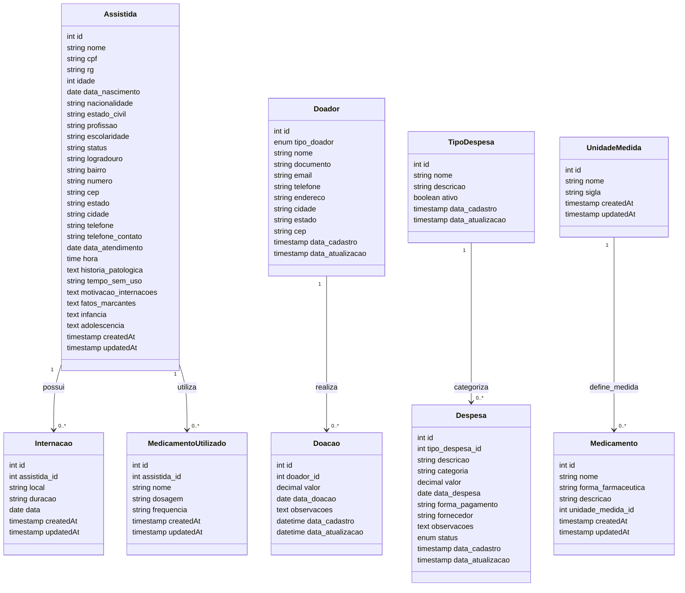

# Modelo Conceitual UML - Sistema Casa+

Reflete a implatacão fisica atual 0.3.0.

## Diagrama de Classes

## Descrição dos Relacionamentos

### 1. Assistida - Internacao

- **Relacionamento**: Uma assistida pode ter várias internações
- **Cardinalidade**: 1:N (Um para Muitos)
- **Nome**: "possui"

### 2. Assistida - MedicamentoUtilizado

- **Relacionamento**: Uma assistida pode utilizar vários medicamentos
- **Cardinalidade**: 1:N (Um para Muitos)
- **Nome**: "utiliza"

### 3. Doador - Doacao

- **Relacionamento**: Um doador pode realizar várias doações
- **Cardinalidade**: 1:N (Um para Muitos)
- **Nome**: "realiza"

### 4. TipoDespesa - Despesa

- **Relacionamento**: Um tipo de despesa pode categorizar várias despesas
- **Cardinalidade**: 1:N (Um para Muitos)
- **Nome**: "categoriza"

### 5. UnidadeMedida - Medicamento

- **Relacionamento**: Uma unidade de medida pode definir a medida de vários medicamentos
- **Cardinalidade**: 1:N (Um para Muitos)
- **Nome**: "define medida"

## Observações do Modelo

1. **Entidades Principais**: O sistema possui 9 entidades principais que representam os conceitos fundamentais do domínio.

2. **Separação de Conceitos**:

   - `Medicamento` representa o cadastro geral de medicamentos disponíveis
   - `MedicamentoUtilizado` representa os medicamentos específicos utilizados por cada assistida

3. **Tipos Enumerados**:

   - `tipo_doador`: PF (Pessoa Física) ou PJ (Pessoa Jurídica)
   - `status` (Despesa): pendente, paga, cancelada

4. **Integridade Referencial**: Todos os relacionamentos possuem chaves estrangeiras que garantem a integridade dos dados.
