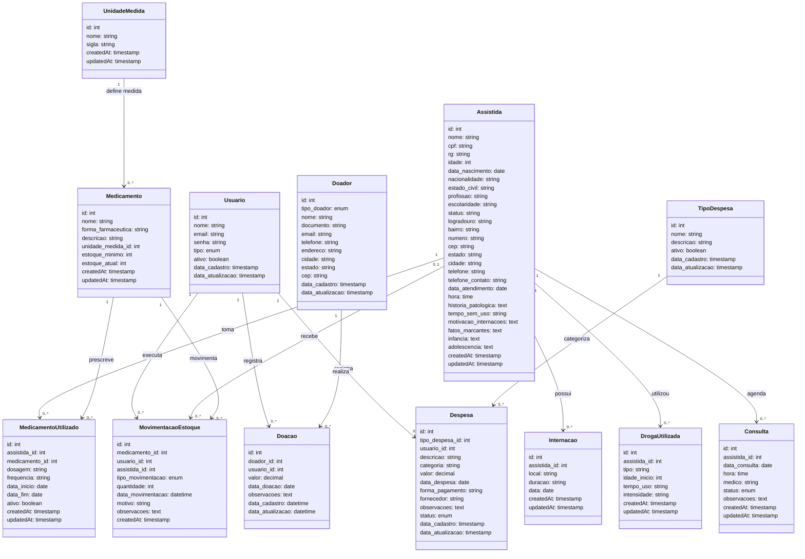

# Modelo Conceitual UML - Sistema Casa+ (Versão 2)

Referencia para melhoria futura.

## Diagrama de Classes - Modelo Conceitual Completo

## Principais Melhorias na Versão 2

### 1. **Sistema de Usuários e Auditoria**

- **Usuario**: Entidade para autenticação e controle de acesso
- **Rastreabilidade**: Todas as operações críticas são associadas a um usuário
- **Tipos**: Administrador, Operador

### 2. **Gestão Médica Completa**

- **Consulta**: Agendamento e controle de consultas médicas
- **DrogaUtilizada**: Histórico de substâncias utilizadas pelas assistidas
- **Status das consultas**: agendada, realizada, cancelada

### 3. **Sistema de Estoque Inteligente**

- **MovimentacaoEstoque**: Controle de entradas e saídas
- **Tipos de movimentação**: entrada, saida_dispensacao, saida_descarte
- **Estoque atual**: Controle automático de quantidades

### 4. **Relacionamentos Aprimorados**

- **MedicamentoUtilizado**: Agora relaciona medicamento do cadastro com prescrição
- **Rastreabilidade**: Quem registrou cada operação
- **Dispensação**: Saídas de estoque podem ser associadas a assistidas específicas

## Descrição dos Relacionamentos

### **Relacionamentos de Usuário (Auditoria)**

- Usuario → Doacao (1:N): "registra"
- Usuario → Despesa (1:N): "registra"
- Usuario → MovimentacaoEstoque (1:N): "executa"

### **Relacionamentos de Assistida**

- Assistida → Internacao (1:N): "possui"
- Assistida → DrogaUtilizada (1:N): "utilizou"
- Assistida → Consulta (1:N): "agenda"
- Assistida → MedicamentoUtilizado (1:N): "toma"
- Assistida → MovimentacaoEstoque (0..1:N): "recebe"

### **Relacionamentos de Medicamento**

- UnidadeMedida → Medicamento (1:N): "define medida"
- Medicamento → MedicamentoUtilizado (1:N): "prescreve"
- Medicamento → MovimentacaoEstoque (1:N): "movimenta"

### **Relacionamentos Financeiros**

- Doador → Doacao (1:N): "realiza"
- TipoDespesa → Despesa (1:N): "categoriza"

## Tipos Enumerados

- **tipo_usuario**: Administrador, Operador
- **tipo_doador**: PF, PJ
- **status_consulta**: agendada, realizada, cancelada
- **status_despesa**: pendente, paga, cancelada
- **tipo_movimentacao**: entrada, saida_dispensacao, saida_descarte

## Conceitos de Negócio Representados

1. **Controle de Acesso**: Sistema completo de usuários
2. **Gestão Médica**: Consultas e histórico de drogas
3. **Controle de Estoque**: Movimentações rastreadas
4. **Auditoria**: Todas as operações têm responsável
5. **Integridade**: Medicamentos utilizados referenciam cadastro geral

## Comparação com Versão 1

### **Entidades Adicionadas na V2**

- **Usuario**: Sistema de autenticação e controle
- **DrogaUtilizada**: Histórico de substâncias
- **Consulta**: Agendamento médico
- **MovimentacaoEstoque**: Controle de estoque

### **Entidades Modificadas na V2**

- **Medicamento**: Adicionados campos de estoque
- **MedicamentoUtilizado**: Relacionado com medicamento do cadastro
- **Doacao/Despesa**: Rastreabilidade com usuário responsável

### **Relacionamentos Adicionados na V2**

- 6 novos relacionamentos de auditoria e controle
- Melhor integridade referencial entre medicamentos
- Controle de dispensação para assistidas específicas
